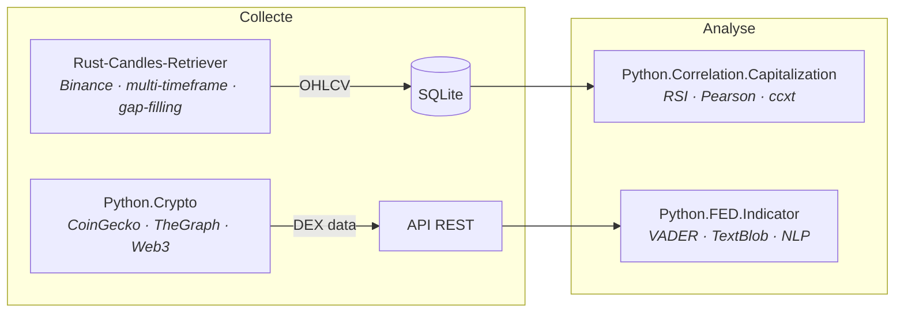

# venantvr.crypto

Analyse de marché crypto : collecte haute performance de données OHLCV, signaux techniques multi-timeframe et analyse macro-économique par NLP.

## Repos

### Collecte de données

 public
*Rust / Actix-Web* — Récupérateur de chandeliers Binance multi-timeframe (5m → 3d) avec stockage SQLite, interpolation automatique des gaps, mode reprise intelligent et visualiseur web interactif TradingView Lightweight Charts avec zoom adaptatif. Backend API Actix-Web, binaire optimisé (LTO).

 privé
*Python / Flask* — Agrégateur de données DEX (Uniswap V2/V3) : collecte CoinGecko, requêtes GraphQL TheGraph, appels on-chain Web3/Geth, résolution de routeurs et listes IPNS. API REST Flask avec mise en cache.

### Analyse

 public
*Python / ccxt* — Identification d'altcoins à faible capitalisation dont le RSI présente une forte corrélation de Pearson avec le Bitcoin, sur plusieurs unités de temps (1h, 4h, 1d). Architecture événementielle multi-threadée avec agents spécialisés (DataFetcher, RSICalculator, DisplayAgent), données via ccxt + CoinGecko, persistance SQLite.

 public
*Python / Flask* — Analyse de sentiment des communiqués de la Réserve fédérale (FED) via trois moteurs NLP : VADER (NLTK), TextBlob document-level et TextBlob phrase-par-phrase. Interface web Flask + Bootstrap.

## Pipeline

## Stack

- **Rust** (Actix-Web, rusqlite, binance-rs, tokio) pour la collecte haute performance
- **Python** (pandas, numpy, ccxt, Flask, NLTK, TextBlob, Web3.py) pour l'analyse
- **SQLite** comme couche de stockage commune
- **TradingView Lightweight Charts** pour la visualisation
- **Binance**, **CoinGecko** et **TheGraph** comme sources de données
